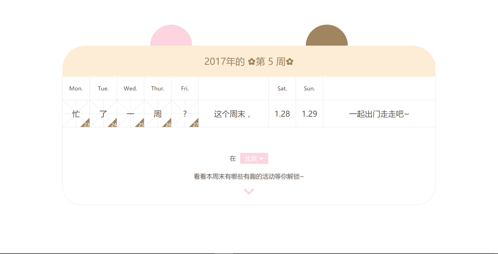
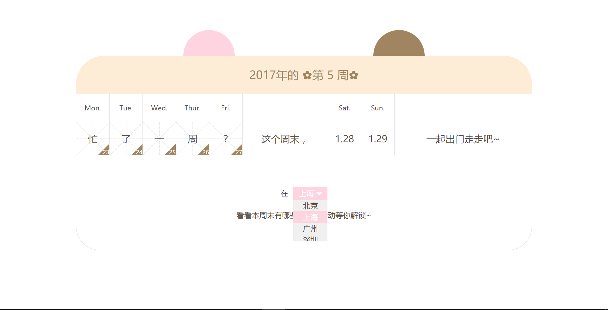
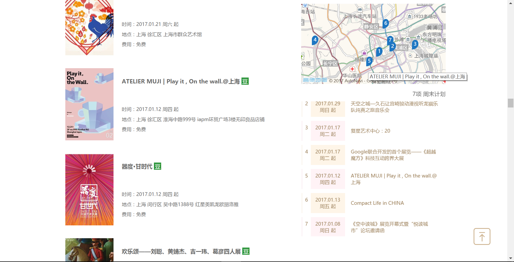
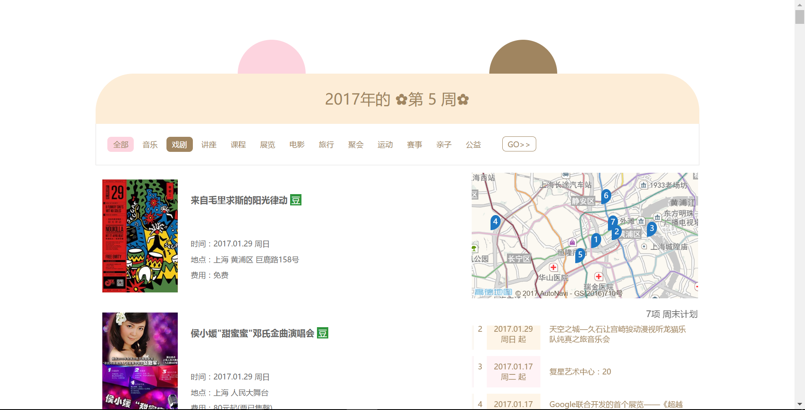

## 简介
这是一款基于豆瓣同城和高德地图API的单页应用，用户可以根据自己感兴趣的活动的位置来规划周末出行。

## 应用演示
当时有这个想法是因为，自己会经常关注豆瓣同城的周末活动，每次打开很多活动页面的同时，还会打开一个地图应用，好在感兴趣的活动中根据路线的便捷程度或者活动的密集程度决定周末的出行。有时感兴趣的活动太多，看着地图会经常忘记这个地址对应什么活动，与活动页面之间来回切换又很是麻烦。于是就想有这么一个应用，可以随时选择自己感兴趣的活动，将之添加至一个列表，并能实时呈现在地图中，以便规划周末行程。前一段时间学了AJAX相关内容，于是就动手设计和完成了下面这个敲可爱的应用，少女心爆棚~
 
1. 初始页面萌萌哒日历：
2. 下拉列表供用户选择所在城市：
3. 选择城市后，用户可以选择自己感兴趣的活动分类（支持多个），也可返回更改所选城市。被自己做的页面萌到了~~
4. 确定分类后，用户可以滚动查看所选分类的周末活动，遇到感兴趣的活动时，点击卡片右下角的加号，添加活动至地图及列表：
5. 用户可以方便地在列表和地图中查看自己感兴趣的活动，点击活动列表标题或活动卡片标题均能打开豆瓣同城的该活动页面：
6. 用户可随时回到顶部，重新选择感兴趣的活动分类：

## 应用展示
可在此应用的[GitHub Pages](https://xdudu.github.io/hang-out-on-weekend/)尽情玩耍~~

## TODOs
1. 更多有趣的地图互动
2. 兼容IE
3. 根据所学不断完善代码~
